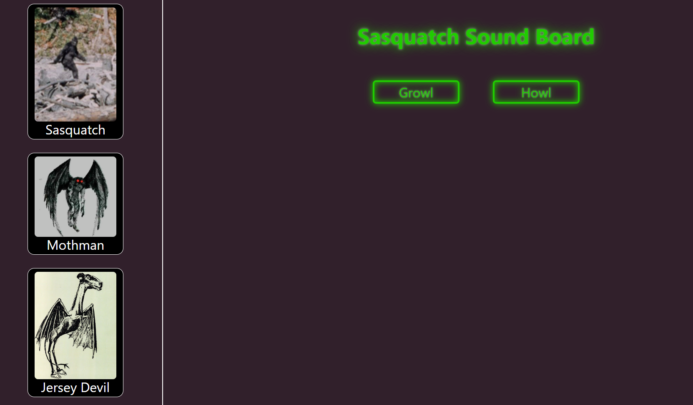

# Cryptid Sound Board

## Description

A fun side project I created to get more familiar with React Hooks and the Stylized-Components library. 

Site is highly responsive and infinitely scalable.

Will add additional sounds/cryptids when I find inspiration. Sounds sourced from https://freesound.org/

## Installation

Live link: https://bryandalton.github.io/cryptidsoundboard/

## Usage

Use the cryptid board on the left to select a cryptid and the sound board on the right to play sounds.

## Credits

Bryan Dalton https://github.com/Bryandalton 

Special thanks to Tom Yancy

## License

N/A
